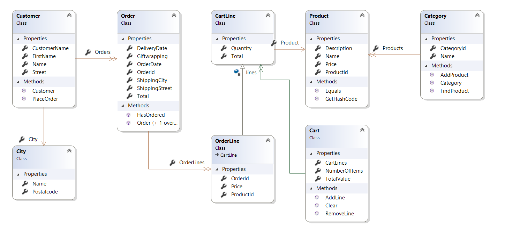

# Oefeningen - LINQ 

## Introductie SportsStore
De domeinlaag bevat klassen voor SportStore. 
Het domein vormt het hart van een online shop die sportartikelen verkoopt. Klanten (`Customer/City`) kunnen in de online shop browsen doorheen de producten (`Product/Category`), en deze naar wens toevoegen aan, of verwijderen uit, een winkelkarretje (`Cart/CartLine`). Desgewenst kan men de producten die in het winkelkarretje liggen ook effectief bestellen (`Order/OrderLine`). 

Lees volgende instructies **grondig** door.

### De solution(.sln) bevat volgende componenten
#### Models
Deze folder bevat de domein laag. 



#### Data
Deze folder bevat 1 klasse `DataSourceProvider`. De DataSourceProvider heeft drie publieke read-only properties. Ze leveren de IEnumerables aan waarop we met Linq zullen werken. 
Als je wil zien wat deze properties bevatten kan je de private `Seed` methode raadplegen in deze klasse maar je hoeft in feite geen verdere kennis te hebben van deze klasse om de oefeningen te kunnen maken.
```cs
public static IEnumerable<Category> Categories {get;set;}
public static IEnumerable<Customer> Customers {get;set;}
public static IEnumerable<Product> Products {get;set;}
```

#### Program.cs
In de `Main` methode van deze klasse vind je bovenaan de declaratie van drie IEnumerables die je zal gebruiken met LINQ:
```cs
IEnumerable<Category> categories = DataSourceProvider.Categories;
IEnumerable<Customer> customers = DataSourceProvider.Customers;
IEnumerable<Product> products = DataSourceProvider.Products;
```

---

## Opgave
In de `Main` methode van `Program.cs` vind je per region een opgave. Je moet telkens de LINQ expressie schrijven die het gevraagde resultaat oplevert. Er is telkens reeds een stukje code voorzien die zorgt voor de uitvoer van het resultaat naar de console.  

> Evalueer zelf steeds goed je resultaat. Je kan gebruik maken van breakpoints om de inhoud van `categories`, `customers` en `products` te bekijken.

